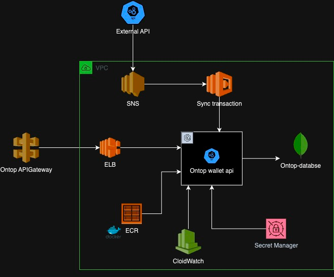
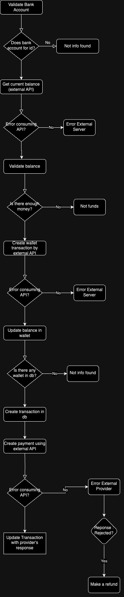

# API Ontop Challenge
This api was built using Java17, Springboot3 and MongoDB and allows users to :

    1. Create a bank account.
    2. Make a transfer between wallet and bank.
    3. Fetch all transactions ordered, paginated and filtered.


# Architecture



# Transfer flow


# Api Reference

## Save bank account

- **Method:** POST
- **Endpoint:** http://ontop-wallet-api.us-east-2.elasticbeanstalk.com/api/bankaccount
- **Description:** Enpoint to save a bank account for a user.
### Headers

No headers, further implementation could include api keys and authorization tokens.

### Body
```json
{
    "userId" : "900",
    "firstName" : "Harry",
    "lastName" : "Kane",
    "routingNumber" : "8213182312",
    "accountNumber" : "99912382139",
    "nationalId" : "73267572"
}
```
### Request Body

| Parameter | Type     | Description           |
| :-------- | :------- |:----------------------|
| `user_id` | `string` | user's Id             |  
| `firstName` | `string` | user's first name     |  
| `lastName` | `string` | user's last name      |  
| `routingNumber` | `string` | user's routing number |  
| `accountNumber` | `string` | user's bank account   |  
| `nationalId` | `string` | user's national id    |  

### Responses

| Code          | Message           
| ------------- |:-------------:       
| 201            | created 
| 400           | Request field null or empty      
| 500            | Internal server error    


## Transfer Request

- **Method:** POST
- **Endpoint:** http://ontop-wallet-api.us-east-2.elasticbeanstalk.com/api/wallet/transfer
- **Description:** Enpoint to make a transfer between wallet and bank.
### Headers

No headers, further implementation could include api keys and authorization tokens.

### Body
```json
{
    "bankAccountId": "f0da7777-8f44-1111-a396-fc74a8f09611",
    "inputAmount" : 800,
    "fee": 0.10
}
```

### Request Body

| Parameter       | Type     | Description                                     |
|:----------------|:---------|:------------------------------------------------|
| `bankAccountId` | `string` | user's bank account ID                          |  
| `inputAmount`   | `double` | requested amount to transfer (before apply fee) |  
| `fee`           | `string` | fee applied                                     |  
                    |
### Responses

| Code          | Message           
| ------------- |:-------------:       
| 200           | code : 00 - message : Process result ok 
| 400           | code : 01 - message : Amount requested is zero or less
| 400           | code : 02 - message : Not funds
| 500           | code : 07 - message : Internal server error
| 404           | code : 03 - message : Not info found
| 200           | code : 07 - message : Bank rejected the transaction


## Query Transactions

- **Method:** GET
- **Endpoint:** http://ontop-wallet-api.us-east-2.elasticbeanstalk.com/api/transactions?bankAccountId=2023-0005&page=0&size=5&amount=800&startDate=20231005&endDate=20231006
- **Description:** Enpoint to fetch all transactions ordered, paginated and filtered.
### Headers

No headers, further implementation could include api keys and authorization tokens.

### Parameters
| Parameter       | Type     | Description                                                            |
|:----------------|:---------|:-----------------------------------------------------------------------|
| `bankAccountId` | `string` | **Required**. user's bank account ID                                   |
| `page`          | `int`    | number of the page requested to fetch                                  |
| `size`          | `int`    | number of records you want to fetch                                    |
| `amount`        | `double` | amount you want to filter (will query records greater than this value) |
| `startDate`     | `string` | Start date for filter, format : yyyyMMdd                               |
| `endDate`       | `string` | End date for filter, format : yyyyMMdd                                 |

### Responses
| Code | Message           
|------|:-------------:       
| 200  | data fetched correctly 
| 404  | No info found  


# Cloud Deployment
For demo purposes the api is deployed in AWS Elastic Beanstalk, the url is http://ontop-wallet-api.us-east-2.elasticbeanstalk.com/api.
API collection to test the api is in the root of the project.

# Local deployment
To deploy the api locally you need to have installed the following tools:

    1. Java 17
    2. Maven
    3. Docker

###Instructions:

    1. Clone the repository
    2. Add mongodb connection string in application.properties
    3. Run the command: mvn clean install
    4. Run the command: docker build -t ontop-app . 
    5. Run the command: docker run -p 8080:8080 ontop-app
    6. The api will be running in http://localhost:8080
